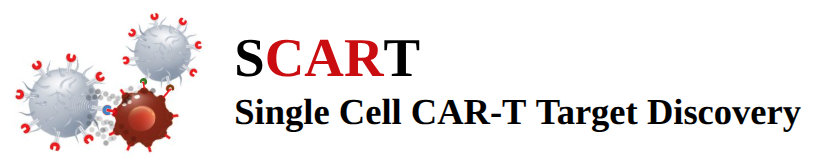

**SCART** (<strong>S</strong>ingle-<strong>C</strong>ell <strong>A</strong>utomated <strong>CAR-T</strong> target discovery) is an end-to-end computational pipeline for identifying tumour-specific surface protein targets for CAR-T cell therapy from single-cell RNA-seq data. Starting from GEO accession IDs or user-provided h5ad files with **RAW** data, SCART automates cell-type annotation, malignant cell identification, surfaceome differential expression, and logic-gate gene combination scoring to rank **One** and **Two** gene combination candidate CAR-T targets by efficacy and safety. 

---

## Instruction and Tutorial

For detailed instructions and tutorial, follow https://csblab23.github.io/SCART/
