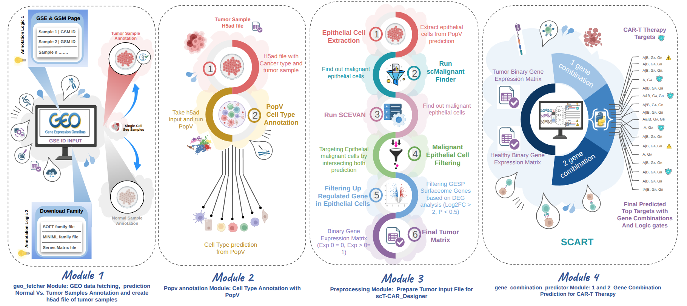
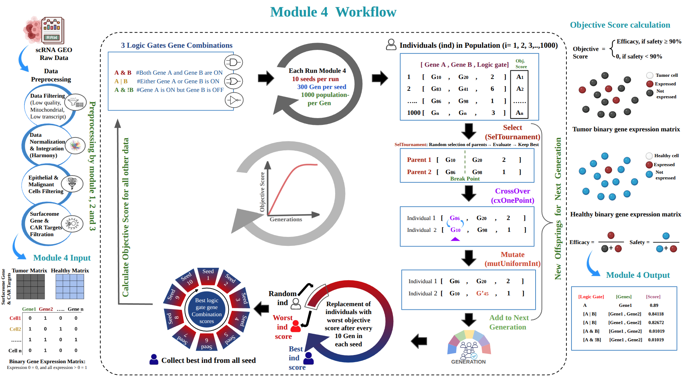

# SCART — Single-Cell CAR-T Target Discovery

**SCART** is an end-to-end computational pipeline for identifying tumour-specific surface protein targets for CAR-T cell therapy from single-cell RNA-seq data. Starting from **RAW** GEO accession IDs or user-provided h5ad files with **RAW** data, SCART automates cell-type annotation, malignant cell identification, surfaceome differential expression, and logic-gate gene combination scoring to rank candidate CAR-T targets by efficacy and safety.



---

 To be added

---

## Table of Contents

- [Overview](#overview)
- [Pipeline Architecture](#pipeline-architecture)
- [Installation](#installation)
- [Quick Start](#quick-start)
  - [Module 1 — Data Acquisition](#module-1--data-acquisition)
  - [Module 2 — Cell-Type Annotation](#module-2--cell-type-annotation)
  - [Module 3 — Preprocessing & Malignancy Detection](#module-3--preprocessing--malignancy-detection)
  - [Module 4a — Single-Gene Scoring](#module-4a--single-gene-scoring)
  - [Module 4b — Two-Gene Logic-Gate Scoring](#module-4b--two-gene-logic-gate-scoring)
- [Module Reference](#module-reference)
  - [Module 1 — Data Acquisition](#module-1--data-acquisition-geo_fetcherpy)
  - [Module 2 — Cell-Type Annotation](#module-2--cell-type-annotation-popv_annotationpy)
  - [Module 3 — Preprocessing & Malignancy Detection](#module-3--preprocessing--malignancy-detection-preprocessingpy)
  - [Module 4a — Single-Gene Scoring](#module-4a--single-gene-scoring-one_gene_combinationpy)
  - [Module 4b — Two-Gene Logic-Gate Scoring](#module-4b--two-gene-logic-gate-scoring-two_gene_combinationpy)
- [Manual Annotation — Skip PopV with Your Own Labels](#manual-annotation--skip-popv-with-your-own-labels)
- [Output Files](#output-files)
- [Parameter Reference](#parameter-reference)

---

## Overview

CAR-T therapy requires surface targets that are highly expressed on tumour cells and absent on healthy tissue. SCART automates this discovery by:

1. Downloading and parsing scRNA-seq datasets from GEO
2. Annotating cell types with PopV (multi-method consensus) — or using your own pre-existing annotations
3. Identifying malignant epithelial cells via scMalignantFinder and SCEVAN
4. Computing differentially expressed surfaceome genes (tumour vs stromal/immune)
5. Scoring every candidate gene — or gene pair with a logic gate — for efficacy (tumour coverage) and safety (healthy tissue sparing)


---

## Installation

### 1. Create and activate the conda environment

```bash
conda create -n scart_env python=3.10 -y
conda activate scart_env
```

> **Windows only** — run these two lines before the next step:
> ```bash
> pip install "orbax-checkpoint<0.5" "flax<0.8"
> pip install scvi-tools==1.1.6.post2
> ```

### 2. Install SCART

```bash
pip install git+https://github.com/csblab23/SCART.git
```

### 3. Install R and SCEVAN dependencies

These are required for SCEVAN (Module 3). Run inside your activated conda environment:

```bash
conda install -c conda-forge -c bioconda \
  r-base r-devtools r-remotes r-ggplot2 r-data.table \
  r-igraph r-gdtools r-ragg r-dplyr \
  cairo freetype fontconfig harfbuzz fribidi \
  libpng libtiff libjpeg libwebp
```

```bash
conda install -c bioconda -c conda-forge \
  r-fgsea \
  bioconductor-genomeinfoDb \
  bioconductor-genomicranges \
  bioconductor-summarizedexperiment \
  bioconductor-singlecellexperiment \
  bioconductor-scuttle \
  bioconductor-scran \
  r-rcurl -y
```

Then inside R:

```r
library(devtools)
install_github("miccec/yaGST")
install_github("AntonioDeFalco/SCEVAN")

# Verify installation
library(SCEVAN)
```

### 4. Set up Jupyter Notebook

```bash
pip install notebook ipykernel
python -m ipykernel install --user --name=scart_env --display-name "Python (scart_env)"
jupyter notebook
```

---

## Quick Start

### Installation check & imports

Before running any module, verify SCART is installed and import the components you need:

```python
import SCART
print(SCART.__version__)   # confirm installation

# ── Per-module imports (copy only what you need) ──────────────────────────
from SCART.geo_fetcher import SampleAnnotator          # Module 1
from SCART import popv_annotation                      # Module 2
from SCART import preprocessing                        # Module 3
from SCART.gene_combination_predictor import one_gene_combination   # Module 4a
from SCART.gene_combination_predictor import two_gene_combination   # Module 4b

# ── Helper: print all valid Tabula Sapiens cancer_type keys ──────────────
from SCART.geo_fetcher import VALID_CANCER_TYPES
print(VALID_CANCER_TYPES)
```

---

### Module 1 — Data Acquisition

```python
from SCART.geo_fetcher import SampleAnnotator

# ── Option 1: Single GEO ID, QC disabled (default) ───────────────────────
annotator = SampleAnnotator("GEO_accession_ID", cancer_type="blood_cancer")

# ── Option 2: Single GEO ID with both QC thresholds ──────────────────────
annotator = SampleAnnotator("GEO_accession_ID", cancer_type="blood_cancer",
                             min_genes=200, max_mt=40)

# ── Option 3: Single GEO ID with gene-count filter only ──────────────────
annotator = SampleAnnotator("GEO_accession_ID", cancer_type="lung_cancer",
                             min_genes=300)

# ── Option 4: Single GEO ID with MT filter only ───────────────────────────
annotator = SampleAnnotator("GEO_accession_ID", cancer_type="ovary_cancer",
                             max_mt=25)

# ── Option 5: Multiple GEO IDs → saves combined_tumor.h5ad ───────────────
annotator = SampleAnnotator("GEO_accession_ID_1", "GEO_accession_ID_2",
                             "GEO_accession_ID_3",
                             cancer_type="blood_cancer",
                             min_genes=200, max_mt=40)

# ── Option 6: Cancer type not in Tabula Sapiens (free-text) ──────────────
# Pipeline stores the label and tells you to supply your own reference file
annotator = SampleAnnotator("GEO_accession_ID", cancer_type="brain_cancer")

# ── Option 7: Multiple cancer types (comma-separated) ────────────────────
annotator = SampleAnnotator("GEO_accession_ID",
                             cancer_type="blood_cancer, bone_marrow_cancer")

# ── Option 8: User-supplied h5ad instead of GEO download ─────────────────
annotator = SampleAnnotator("/path/to/my_data.h5ad",
                             cancer_type="ovary_cancer",
                             min_genes=200, max_mt=40)

# ── Option 9: Mixed — GEO ID + user h5ad combined ────────────────────────
annotator = SampleAnnotator("GEO_accession_ID", "/path/to/extra_data.h5ad",
                             cancer_type="lung_cancer",
                             min_genes=200, max_mt=40)

# ── Option 10: User h5ad WITH manual cell-type annotations ───────────────
# Skips Module 2 (PopV) entirely — go straight to Module 3 after this
annotator = SampleAnnotator(
    "my_data.h5ad",
    cancer_type="ovary_cancer",
    manual_annotation_col="cell_type",   # name of your obs column
    min_genes=200,
    max_mt=40,
)

# ── Option 11: Manually exclude specific GSM IDs ─────────────────────────
# Run without exclude_gsm_ids first to inspect the sample summary,
# then re-run with the IDs you want to drop.
#
# Use cases:
#   - CAR-T therapy studies: exclude engineered cell products (CAR+)
#     and keep only patient-derived PBMC samples (CAR-)
#   - Any study: drop samples with known quality issues
#   - Any study: remove samples that do not match your biological question
#
annotator = SampleAnnotator(
    "GSE224550",
    cancer_type="blood_cancer",
    exclude_gsm_ids=[
        "GSM7025839", "GSM7025840",   # CAR-T product — patient P1
        "GSM7025847", "GSM7025848",   # CAR-T product — patient P2
        "GSM7025855", "GSM7025856",   # CAR-T product — patient P7
        "GSM7025863", "GSM7025864",   # CAR-T product — patient P8
    ],
)

# ── Run (same call for all options above) ────────────────────────────────
normal, tumor, unspecified, annotation_info, query_h5ad, cancer_type, results = annotator.run()

# ── What you get ──────────────────────────────────────────────────────────
# normal          → list of normal sample IDs
# tumor           → list of tumour sample IDs
# unspecified     → list of unclassified sample IDs
# annotation_info → dict mapping sample ID → "tumor" / "normal" / "unspecified"
#                   manually excluded IDs map to "manually_excluded"
# query_h5ad      → path to the saved tumour h5ad (input for Module 2)
# cancer_type     → cancer type string supplied by the user
# results         → full per-GSE result dictionary
```

> **Output files**
> - Single GEO run → `GSE*_tumor.h5ad`
> - Multiple inputs → `combined_tumor.h5ad`
> - User h5ad input → `input_tumor.h5ad`

> **`cancer_type` is required.**
> Pass one of the Tabula Sapiens keys (e.g. `"blood_cancer"`) for an automatic
> reference recommendation, or any free-text string (e.g. `"brain_cancer"`) if
> your cancer type is not in Tabula Sapiens — you will be instructed to supply
> your own reference.
> To see all Tabula Sapiens keys:
> ```python
> from SCART.geo_fetcher import VALID_CANCER_TYPES
> print(VALID_CANCER_TYPES)
> ```

> **Excluding specific samples (`exclude_gsm_ids`)**
> No samples are automatically excluded based on cell type — all classified
> samples appear in the summary.  After reviewing the summary, pass any IDs
> you want to drop via `exclude_gsm_ids`.  They will be skipped when building
> the h5ad and listed as "Manually excluded" in the output so the decision is
> fully traceable.  This is the recommended approach for CAR-T therapy
> datasets where engineered cell products (CAR+ samples) should not be
> included alongside patient-derived disease samples.

> **Manual annotation note**
> When `manual_annotation_col` is provided, Module 1 stores `adata.uns['skip_popv'] = True`
> and copies your column into `popv_majority_vote_prediction`. Skip Module 2 entirely
> and proceed directly to Module 3. See [Manual Annotation](#manual-annotation--skip-popv-with-your-own-labels) for full details.

---

### Module 2 — Cell-Type Annotation

> **Skip this module** if you used `manual_annotation_col` in Module 1
> (`adata.uns['skip_popv'] == True`). Go directly to Module 3.

```python
from SCART import popv_annotation

# ── Option 1: User-supplied tissue reference (recommended) ───────────────
# Module 1 prints which Tabula Sapiens file to download for your cancer type
adata = popv_annotation.auto_run_popv(
    input_type     = "raw",
    nsamples       = 300,
    user_reference = "/path/to/Ovary_TSP1_30_version2d_10X_smartseq_scvi.h5ad"
)

# ── Option 2: Auto-download reference from Figshare ──────────────────────
adata = popv_annotation.auto_run_popv(
    input_type = "raw",
    nsamples   = 300,
)

# ── Option 3: Pre-log-normalised input (runs CELLTYPIST only) ────────────
adata = popv_annotation.auto_run_popv(
    input_type     = "log1p",
    nsamples       = 300,
    user_reference = "/path/to/reference.h5ad"
)

# ── Option 4: Custom output directory ────────────────────────────────────
adata = popv_annotation.auto_run_popv(
    input_type     = "raw",
    nsamples       = 300,
    output_dir     = "/path/to/my_popv_results/",
    user_reference = "/path/to/reference.h5ad"
)

# ── Option 5: Keep Tabula Sapiens metadata columns in output ─────────────
adata = popv_annotation.auto_run_popv(
    input_type             = "raw",
    nsamples               = 300,
    user_reference         = "/path/to/reference.h5ad",
    drop_reference_columns = False
)

# ── What you get ──────────────────────────────────────────────────────────
# adata → AnnData saved to popv_results/final_popv_annotated.h5ad
# Key column: adata.obs['popv_majority_vote_prediction']
```

> **Output files**
> - `popv_results/final_popv_annotated.h5ad`

---

### Module 3 — Preprocessing & Malignancy Detection

```python
from SCART import preprocessing

# ── Option 1: Standard run with SCEVAN + scMalignantFinder ───────────────
adata_preprocessed = preprocessing.run_preprocessing_pipeline(
    reference_h5ad     = "/path/to/tissue_reference.h5ad",
    log2fc_threshold   = 2.0,
    pval_adj_threshold = 0.05,
    malignant_strategy = "intersection",
)

# ── Option 2: scMalignantFinder only (no SCEVAN) ─────────────────────────
adata_preprocessed = preprocessing.run_preprocessing_pipeline(
    malignant_strategy = "scMalignant",
    log2fc_threshold   = 2.0,
    pval_adj_threshold = 0.05,
)

# ── Option 3: SCEVAN only ─────────────────────────────────────────────────
adata_preprocessed = preprocessing.run_preprocessing_pipeline(
    reference_h5ad     = "/path/to/tissue_reference.h5ad",
    malignant_strategy = "scevan",
    log2fc_threshold   = 2.0,
    pval_adj_threshold = 0.05,
)

# ── Option 4: Relaxed DEG filters ─────────────────────────────────────────
adata_preprocessed = preprocessing.run_preprocessing_pipeline(
    reference_h5ad     = "/path/to/tissue_reference.h5ad",
    malignant_strategy = "intersection",
    log2fc_threshold   = 0.5,
    pval_adj_threshold = 0.10,
)

# ── Option 5: Tune SCEVAN reference cell count ────────────────────────────
adata_preprocessed = preprocessing.run_preprocessing_pipeline(
    reference_h5ad       = "/path/to/tissue_reference.h5ad",
    malignant_strategy   = "intersection",
    scevan_ref_max_cells = 200,
)

# ── Option 6: Explicit file paths ─────────────────────────────────────────
adata_preprocessed = preprocessing.run_preprocessing_pipeline(
    popv_path      = "/path/to/final_popv_annotated.h5ad",
    tumor_h5ad     = "/path/to/tumor.h5ad",
    reference_h5ad = "/path/to/tissue_reference.h5ad",
    save_dir       = "/path/to/my_output_dir/",
)

# ── Option 7: Manual annotation path (after skipping PopV) ───────────────
adata_preprocessed = preprocessing.run_preprocessing_pipeline(
    adata              = sc.read_h5ad("input_tumor.h5ad"),
    reference_h5ad     = "/path/to/tissue_reference.h5ad",
    malignant_strategy = "intersection",
    log2fc_threshold   = 2.0,
    pval_adj_threshold = 0.05,
)

# ── What you get ──────────────────────────────────────────────────────────
print(adata_preprocessed.uns["filtered_deg"].head(10))
```

> **Output files**
> - `preprocessing_results/final_tumor.h5ad`

---

### Module 4a — Single-Gene Scoring

```python
from SCART.gene_combination_predictor import one_gene_combination

df = one_gene_combination.run(
    hpa_path         = "/path/to/HPA_updated.h5ad",
    safety_threshold = 0.9,
)

df_filtered = df[df["Safety"] >= 0.9].sort_values("Efficacy", ascending=False)
print(df_filtered.head(10))
```

> **Output files**
> - `single_gene_results.csv` — columns: `gene`, `efficacy`, `safety`

---

### Module 4b — Two-Gene Logic-Gate Scoring

```python
from SCART.gene_combination_predictor import two_gene_combination

df_hof, df_all = two_gene_combination.run(
    hpa_path         = "/path/to/HPA_updated.h5ad",
    safety_threshold = 0.9,
    pop_size         = 1000,
    Gmax             = 100,
    patience         = 50,
    n_cpus           = 8,
    n_runs           = 10,
)

and_pairs = df_hof[df_hof["LogicGates"] == "A & B"]
print(and_pairs.head(10))
```

> **Output files**
> - `two_gene_hof.csv` — Hall of Fame: best unique pairs. Columns: `seed_value`, `generation`, `LogicGates`, `Genes`, `Efficacy`, `Safety`
> - `two_gene_complete.csv` — all evaluated pairs across every generation and run

---

## Module Reference

### Module 1 — Data Acquisition (`geo_fetcher.py`)

Downloads GEO datasets or accepts existing h5ad files, classifies samples as tumour/normal/unspecified, and writes a tumour h5ad for downstream modules.

```python
from SCART.geo_fetcher import SampleAnnotator

annotator = SampleAnnotator(*inputs, cancer_type, min_genes=None, max_mt=None,
                             manual_annotation_col=None)
normal, tumor, unspecified, annotation_info, query_h5ad, cancer_type, results = annotator.run()
```

**Parameters**

| Parameter | Type | Default | Description |
|---|---|---|---|
| `*inputs` | str | — | One or more GEO accession IDs (e.g. `"GSExxxxxx"`) or paths to `.h5ad` files |
| `cancer_type` | str | **required** | Cancer type label. Pass a Tabula Sapiens key for an automatic reference recommendation, or any free-text string for unknown types. Multiple types accepted as comma-separated: `"blood_cancer, bone_marrow_cancer"` |
| `min_genes` | int or None | `None` | Minimum genes per cell for QC in Module 3. `None` = QC skipped |
| `max_mt` | float or None | `None` | Maximum mitochondrial % per cell. `None` = QC skipped |
| `manual_annotation_col` | str or None | `None` | Name of the obs column in your h5ad that contains cell-type labels. When set, Module 2 (PopV) is skipped. Only applies to h5ad inputs — ignored for GEO IDs |

**`cancer_type` — Tabula Sapiens keys**

Pass any of the following exact strings for an automatic reference recommendation.
The table shows the `cancer_type` key you pass, the tissue it covers, and the exact
Tabula Sapiens filename to download from
[https://doi.org/10.6084/m9.figshare.27921984](https://doi.org/10.6084/m9.figshare.27921984).

| `cancer_type=` key | Tissue / Cancer | Tabula Sapiens filename to download |
|---|---|---|
| `"bladder_cancer"` | Bladder / urothelial carcinoma, transitional cell carcinoma | `Bladder_TSP1_30_version2d_10X_smartseq_scvi_Nov122024.h5ad` |
| `"blood_cancer"` | Blood / leukaemia (AML, CML, ALL, CLL), lymphoma, myeloma, PBMC | `Blood_TSP1_30_version2d_10X_smartseq_scvi_Nov122024.h5ad` |
| `"bone_marrow_cancer"` | Bone marrow / multiple myeloma, MDS, myelofibrosis, aplastic anaemia | `Bone_Marrow_TSP1_30_version2d_10X_smartseq_scvi_Nov122024.h5ad` |
| `"ear_cancer"` | Ear / vestibular schwannoma, acoustic neuroma, glomus jugulare | `Ear_TSP1_30_version2d_10X_smartseq_scvi_Nov122024.h5ad` |
| `"eye_cancer"` | Eye / retinoblastoma, uveal melanoma, conjunctival, orbital tumour | `Eye_TSP1_30_version2d_10X_smartseq_scvi_Nov122024_updated.h5ad` |
| `"fat_cancer"` | Adipose / liposarcoma (well-differentiated, dedifferentiated, myxoid) | `Fat_TSP1_30_version2d_10X_smartseq_scvi_Nov122024.h5ad` |
| `"heart_cancer"` | Heart / cardiac myxoma, cardiac sarcoma, rhabdomyoma, fibroma | `Heart_TSP1_30_version2d_10X_smartseq_scvi_Nov122024.h5ad` |
| `"kidney_cancer"` | Kidney / renal cell carcinoma (clear cell, papillary, chromophobe), Wilms tumour | `Kidney_TSP1_30_version2d_10X_smartseq_scvi_Nov122024.h5ad` |
| `"large_intestine_cancer"` | Colon & rectum / colorectal cancer, CRC, microsatellite instability | `Large_Intestine_TSP1_30_version2d_10X_smartseq_scvi_Nov122024.h5ad` |
| `"liver_cancer"` | Liver / hepatocellular carcinoma (HCC), intrahepatic cholangiocarcinoma, gallbladder | `Liver_TSP1_30_version2d_10X_smartseq_scvi_Nov122024.h5ad` |
| `"lung_cancer"` | Lung / NSCLC (LUAD, LUSC), SCLC, mesothelioma, pleural, bronchial | `Lung_TSP1_30_version2d_10X_smartseq_scvi_Nov122024.h5ad` |
| `"lymph_node_cancer"` | Lymph node / DLBCL, follicular lymphoma, Hodgkin, mantle cell, Burkitt | `Lymph_Node_TSP1_30_version2d_10X_smartseq_scvi_Nov122024.h5ad` |
| `"breast_cancer"` | Breast / TNBC, HER2+, luminal A/B, IDC, ILC, DCIS, inflammatory breast | `Mammary_TSP1_30_version2d_10X_smartseq_scvi_Nov122024.h5ad` |
| `"muscle_cancer"` | Muscle / rhabdomyosarcoma, leiomyosarcoma, synovial sarcoma, soft tissue sarcoma | `Muscle_TSP1_30_version2d_10X_smartseq_scvi_Nov122024.h5ad` |
| `"ovary_cancer"` | Ovary / HGSOC, LGSOC, clear cell, endometrioid, mucinous, fallopian tube | `Ovary_TSP1_30_version2d_10X_smartseq_scvi_Nov262024.h5ad` |
| `"pancreas_cancer"` | Pancreas / PDAC, pancreatic neuroendocrine tumour (PNET), acinar cell | `Pancreas_TSP1_30_version2d_10X_smartseq_scvi_Nov122024.h5ad` |
| `"prostate_cancer"` | Prostate / prostate adenocarcinoma, castration-resistant (CRPC), neuroendocrine prostate | `Prostate_TSP1_30_version2d_10X_smartseq_scvi_Nov122024.h5ad` |
| `"salivary_gland_cancer"` | Salivary gland / mucoepidermoid carcinoma, adenoid cystic, acinic cell, parotid | `Salivary_Gland_TSP1_30_version2d_10X_smartseq_scvi_Nov122024.h5ad` |
| `"skin_cancer"` | Skin / cutaneous melanoma, squamous cell, basal cell, Merkel cell, acral melanoma | `Skin_TSP1_30_version2d_10X_smartseq_scvi_Nov122024_updated.h5ad` |
| `"small_intestine_cancer"` | Small intestine / duodenal, jejunal, ileal carcinoma, GIST | `Small_Intestine_TSP1_30_version2d_10X_smartseq_scvi_Nov122024.h5ad` |
| `"spleen_cancer"` | Spleen / splenic marginal zone lymphoma, splenic haemangioma | `Spleen_TSP1_30_version2d_10X_smartseq_scvi_Nov122024.h5ad` |
| `"stomach_cancer"` | Stomach / gastric carcinoma, signet ring, diffuse gastric, gastroesophageal junction | `Stomach_TSP1_30_version2d_10X_smartseq_scvi_Nov122024.h5ad` |
| `"testis_cancer"` | Testis / seminoma, non-seminoma, germ cell tumour, yolk sac tumour, teratoma | `Testis_TSP1_30_version2d_10X_smartseq_scvi_Nov122024.h5ad` |
| `"thymus_cancer"` | Thymus / thymoma, thymic carcinoma, thymic epithelial tumour | `Thymus_TSP1_30_version2d_10X_smartseq_scvi_Nov122024.h5ad` |
| `"tongue_cancer"` | Tongue / oral tongue squamous cell carcinoma, lingual carcinoma | `Tongue_TSP1_30_version2d_10X_smartseq_scvi_Nov122024.h5ad` |
| `"trachea_cancer"` | Trachea / tracheal carcinoma, airway tumour | `Trachea_TSP1_30_version2d_10X_smartseq_scvi_Nov122024.h5ad` |
| `"uterus_cancer"` | Uterus / endometrial carcinoma, cervical carcinoma, uterine sarcoma, leiomyosarcoma | `Uterus_TSP1_30_version2d_10X_smartseq_scvi_Nov122024.h5ad` |
| `"vasculature_cancer"` | Vasculature / angiosarcoma, Kaposi sarcoma, haemangioendothelioma | `Vasculature_TSP1_30_version2d_10X_smartseq_scvi_Nov122024.h5ad` |

> **Not in the table?** For any cancer type not listed above (e.g. `"brain_cancer"`,
> `"thyroid_cancer"`, `"esophageal_cancer"`), pass the label as a free-text string.
> The pipeline stores the label in `adata.uns['cancer_type']` and instructs you to
> supply your own reference file for PopV / SCEVAN. No error is raised.

To print all valid Tabula Sapiens keys at runtime:
```python
from SCART.geo_fetcher import VALID_CANCER_TYPES
print(VALID_CANCER_TYPES)
```

**Sample classification logic**

Each GSM is classified in strict priority order (first match wins):

| Priority | Label | Matched by |
|---|---|---|
| 1 | **normal** | `normal`, `healthy`, `control`, `adjacent normal`, `non-tumor`, `non-cancer`, `benign`, `non-malignant` |
| 2 | **tumor** | Any keyword in the disease keyword list (see below) |
| 3 | **unspecified** | Neither group matched |

The tumour keyword list covers both generic terms (`tumor`, `carcinoma`, `malignant`) and
haematological / disease-specific aliases so that blood cancer datasets whose GSM
descriptions use disease names instead of "tumor" are correctly classified.
Example terms: `aml`, `cml`, `all`, `cll`, `leukemia`, `leukaemia`, `lymphoma`,
`myeloma`, `myelodysplastic`, `dlbcl`, `hodgkin`, `multiple myeloma`, `pdac`,
`glioblastoma`, `melanoma`, `sarcoma`, and many more.

**Tarball extraction**

GEO sometimes ships the 10x MTX triplet inside a `.tar.gz` archive
(e.g. `GSM4257051_G2_filtered_feature_bc_matrix.tar.gz`).
Module 1 automatically extracts any such archives before reading, then
recursively locates the `matrix.mtx.gz` / `features.tsv.gz` / `barcodes.tsv.gz`
triplet even if it lands in a sub-directory after extraction.
Already-extracted files are detected and skipped on re-runs.

**Output files**

| File | Description |
|---|---|
| `GSE*_tumor.h5ad` | Single GEO run — tumour cells only |
| `combined_tumor.h5ad` | Multiple inputs merged |
| `input_tumor.h5ad` | User-supplied h5ad input |

**QC parameter flow**

QC thresholds set here are stored in `adata.uns['qc_params']` and automatically read by Module 3. If neither `min_genes` nor `max_mt` is provided, the QC step in Module 3 is skipped entirely — no defaults are silently applied.

**Cancer type flow**

The user-supplied `cancer_type` is stored in `adata.uns['cancer_type']` and used for
reference guidance printed at the end of `run()`. Tabula Sapiens keys receive a specific
file recommendation; unknown labels receive a message to supply a custom reference.

**Manual annotation flow**

When `manual_annotation_col` is set on an h5ad input, Module 1 copies that column into
`adata.obs['popv_majority_vote_prediction']` and sets `adata.uns['skip_popv'] = True`.
Module 3 reads `popv_majority_vote_prediction` identically regardless of whether it came
from PopV or manual annotation. See [Manual Annotation](#manual-annotation--skip-popv-with-your-own-labels) for label requirements.

---

### Module 2 — Cell-Type Annotation (`popv_annotation.py`)

Annotates cell types using PopV, a consensus framework that runs multiple methods (CELLTYPIST, KNN-BBKNN, KNN-SCVI, KNN-HARMONY, ONCLASS, SCANVI, Support Vector, Random Forest) and reports a majority-vote prediction.

> **This module can be skipped** when `manual_annotation_col` was provided in Module 1.
> The output h5ad will contain `adata.uns['skip_popv'] = True` — if you call
> `auto_run_popv()` on such a file it will exit immediately with a clear message.

```python
from SCART import popv_annotation

adata = popv_annotation.auto_run_popv(
    input_type            = "raw",
    nsamples              = 300,
    output_dir            = "popv_results",
    user_reference        = "/path/to/reference.h5ad",
    drop_reference_columns = True,
)
```

**Parameters**

| Parameter | Type | Default | Description |
|---|---|---|---|
| `input_type` | str | `"raw"` | `"raw"` for raw counts; `"log1p"` for pre-normalised data (runs CELLTYPIST only) |
| `nsamples` | int | `300` | Cells sampled per cell-type label during reference subsampling |
| `output_dir` | str | `"popv_results"` | Directory where `final_popv_annotated.h5ad` is saved |
| `user_reference` | str or None | `None` | Path to Tabula Sapiens tissue h5ad. If `None`, auto-downloaded from Figshare |
| `drop_reference_columns` | bool | `True` | Remove Tabula Sapiens metadata columns from output |

**Reference files**

Tabula Sapiens tissue references are available at: https://doi.org/10.6084/m9.figshare.27921984

Module 1 prints the recommended reference file for your cancer type at the end of its run.

**Output files**

| File | Description |
|---|---|
| `popv_results/final_popv_annotated.h5ad` | Full dataset with `popv_majority_vote_prediction` column and `layers['counts']` for Module 3 |

---

### Module 3 — Preprocessing & Malignancy Detection (`preprocessing.py`)

Identifies malignant epithelial cells using scMalignantFinder and SCEVAN, performs surfaceome differential expression analysis, and outputs a binarised tumour matrix for Module 4.

Epithelial cells are selected by substring-matching `"epithelial cell"` (case-insensitive) in `popv_majority_vote_prediction` — this captures all variants such as `"ovarian surface epithelial cell"`, `"glandular epithelial cell"`, `"lung epithelial cell"`, etc.

When the input h5ad has `adata.uns['skip_popv'] = True` (manual annotation path), Module 3 detects this automatically, validates the label column, and proceeds identically — no code changes needed.

```python
from SCART import preprocessing

adata_preprocessed = preprocessing.run_preprocessing_pipeline(
    reference_h5ad     = "/path/to/tissue_reference.h5ad",
    log2fc_threshold   = 2.0,
    pval_adj_threshold = 0.05,
    malignant_strategy = "intersection",
    scevan_ref_cell_col          = "cell_ontology_class",
    scevan_ref_epithelial_values = None,
    scevan_ref_max_cells         = 500,
    scevan_sample_name           = "SCEVAN_run",
    scevan_organism              = "human",
    scevan_par_cores             = 1,
    scevan_subclones             = False,
    scevan_batch_size            = 3000,
)
```

**Parameters**

| Parameter | Type | Default | Description |
|---|---|---|---|
| `adata` | AnnData or None | `None` | Module 2 output. Auto-loaded from `popv_results/` if None |
| `popv_path` | str or None | `None` | Explicit path to PopV h5ad |
| `log2fc_threshold` | float | `1.0` | DEG log2 fold-change cutoff |
| `pval_adj_threshold` | float | `0.05` | DEG BH-adjusted p-value cutoff |
| `reference_h5ad` | str or None | `None` | h5ad for SCEVAN normal reference. SCEVAN skipped if None |
| `tumor_h5ad` | str or None | `None` | Module 1 h5ad for scMalignantFinder full-gene recovery. Auto-detected if None |
| `save_dir` | str or None | `None` | Output directory. Default: `<cwd>/preprocessing_results/` |
| `malignant_strategy` | str | `"intersection"` | `"intersection"` (both tools must agree), `"scMalignant"`, or `"scevan"` |
| `scevan_ref_cell_col` | str or None | `"cell_ontology_class"` | Column in reference h5ad used to identify cell types. Set to `None` to skip filtering |
| `scevan_ref_epithelial_values` | list or None | `None` | Exact label list to select epithelial cells. `None` = auto-detect by substring match |
| `scevan_ref_max_cells` | int or None | `500` | Maximum normal reference cells subsampled for SCEVAN |
| `scevan_sample_name` | str | `"SCEVAN_run"` | Prefix for SCEVAN output files |
| `scevan_organism` | str | `"human"` | `"human"` or `"mouse"` |
| `scevan_par_cores` | int | `1` | CPU cores per SCEVAN batch |
| `scevan_subclones` | bool | `False` | Whether SCEVAN infers tumour subclones |
| `scevan_batch_size` | int | `3000` | Query cells per SCEVAN batch |

**QC thresholds** are not parameters here — they are read automatically from `adata.uns['qc_params']` set in Module 1.

#### Module 3 — SCEVAN Reference Configuration

**Mode A — Tabula Sapiens (default)**

```python
preprocessing.run_preprocessing_pipeline(
    reference_h5ad               = "Ovary_ref_Tabula_sapiens.h5ad",
    scevan_ref_cell_col          = "cell_ontology_class",
    scevan_ref_epithelial_values = None,
    scevan_ref_max_cells         = 500,
)
```

**Mode B — Custom reference with your own labels**

```python
preprocessing.run_preprocessing_pipeline(
    reference_h5ad               = "my_reference.h5ad",
    scevan_ref_cell_col          = "cell_type",
    scevan_ref_epithelial_values = ["Normal Epithelial cells", "epithelial"],
    scevan_ref_max_cells         = None,
)
```

**Mode C — Pre-filtered reference (already epithelial only)**

```python
preprocessing.run_preprocessing_pipeline(
    reference_h5ad       = "epithelial_ref_only.h5ad",
    scevan_ref_cell_col  = None,
    scevan_ref_max_cells = None,
)
```

**Output files**

| File | Description |
|---|---|
| `preprocessing_results/final_tumor.h5ad` | Malignant epithelial cells, surfaceome-filtered, binarised |

---

### Module 4a — Single-Gene Scoring (`one_gene_combination.py`)

```python
from SCART.gene_combination_predictor import one_gene_combination

df = one_gene_combination.run(
    hpa_path         = "/path/to/HPA_updated.h5ad",
    safety_threshold = 0.9,
)
```

**Parameters**

| Parameter | Type | Default | Description |
|---|---|---|---|
| `safety_threshold` | float | `0.9` | Minimum fraction of healthy cells that must NOT express the gene |
| `hpa_path` | str or None | `None` | Healthy reference (`.h5ad` or `.tsv`). Auto-downloaded if `None` |
| `tumor_path` | str or None | `None` | Module 3 output. Auto-detected if None |

**Output files**

| File | Description |
|---|---|
| `single_gene_results.csv` | All genes scored. Columns: `gene`, `efficacy`, `safety` |

---

### Module 4b — Two-Gene Logic-Gate Scoring (`two_gene_combination.py`)

**Logic gates evaluated:**

| Gate | Meaning |
|---|---|
| `A & B` | Both genes expressed |
| `A \| B` | Either gene expressed |
| `A & !B` | A expressed, B NOT expressed |

```python
from SCART.gene_combination_predictor import two_gene_combination

df_hof, df_all = two_gene_combination.run(
    hpa_path         = "/path/to/HPA_updated.h5ad",
    safety_threshold = 0.9,
    pop_size         = 1000,
    Gmax             = 100,
    patience         = 50,
    n_cpus           = 8,
    n_runs           = 10,
)
```

**Parameters**

| Parameter | Type | Default | Description |
|---|---|---|---|
| `hpa_path` | str or None | `None` | Healthy reference path |
| `tumor_path` | str or None | `None` | Module 3 output. Auto-detected if None |
| `safety_threshold` | float | `0.9` | Minimum healthy-cell safety |
| `pop_size` | int | `1000` | GA population size per generation |
| `Gmax` | int | `100` | Maximum generations |
| `Ggap` | int | `10` | Random immigrant injection interval |
| `Rrep` | float | `0.1` | Fraction of population replaced at each Ggap |
| `patience` | int | `50` | Early stop if fitness does not improve for N generations |
| `n_cpus` | int | `1` | CPU cores for parallel fitness evaluation |
| `n_runs` | int | `10` | Independent GA runs with different random seeds |

**Recommended settings by hardware**

```python
# Laptop (quick test)
two_gene_combination.run(pop_size=200, Gmax=20, patience=10, n_cpus=4, n_runs=2)

# Standard workstation
two_gene_combination.run(pop_size=1000, Gmax=100, patience=50, n_cpus=8, n_runs=10)

# HPC node
two_gene_combination.run(pop_size=2000, Gmax=200, patience=100, n_cpus=40, n_runs=10)
```

**Output files**

| File | Description |
|---|---|
| `two_gene_hof.csv` | Hall of Fame — best unique gene pairs. Columns: `seed_value`, `generation`, `LogicGates`, `Genes`, `Efficacy`, `Safety` |
| `two_gene_complete.csv` | All evaluated pairs across every generation and run |

---

## Manual Annotation — Skip PopV with Your Own Labels

If you already have cell-type annotations (from Seurat, Scanpy, CellTypist, or any other tool), you can skip Module 2 (PopV) entirely by providing your annotation column in Module 1.

### When to use this

Use `manual_annotation_col` when you supply your own `.h5ad` file and already have reliable cell-type labels. GEO ID inputs always run the full PopV pipeline regardless of this parameter.

### How to use it

```python
from SCART.geo_fetcher import SampleAnnotator

annotator = SampleAnnotator(
    "my_data.h5ad",
    cancer_type="ovary_cancer",
    manual_annotation_col="cell_type",
    min_genes=200,
    max_mt=40,
)
normal, tumor, unspecified, annotation_info, query_h5ad, cancer_type, results = annotator.run()
```

After `run()` completes, skip Module 2 entirely and go straight to Module 3:

```python
from SCART import preprocessing
adata_mal = preprocessing.run_preprocessing_pipeline(
    reference_h5ad     = "/path/to/tissue_reference.h5ad",
    malignant_strategy = "intersection",
)
```

### Requirements for your annotation column

**Column must exist in adata.obs.** A clear error listing all available columns is raised if it is missing.

**Epithelial labels must contain "epithelial cell".** Module 3 identifies epithelial cells by substring-matching `"epithelial cell"` (case-insensitive). Examples:

| Label | Valid? |
|---|---|
| `epithelial cell` | ✅ |
| `glandular epithelial cell` | ✅ |
| `ovarian surface epithelial cell` | ✅ |
| `luminal epithelial cell` | ✅ |
| `epithelial` | ❌ — does not contain "epithelial cell" |
| `Epithelial_cells` | ❌ — does not contain "epithelial cell" |
| `cancer cell` | ❌ — not recognised as epithelial |

Module 1 prints a warning immediately if no epithelial labels are detected.

**All other labels are treated as non-epithelial** (the "rest" comparison group for DEG).

### What is stored in the output h5ad

| Key | Location | Value |
|---|---|---|
| `manual_annotation_col` | `adata.uns` | your column name |
| `skip_popv` | `adata.uns` | `True` |
| `popv_majority_vote_prediction` | `adata.obs` | copy of your annotation column |

### Multiple h5ad files

```python
annotator = SampleAnnotator(
    "dataset1.h5ad",
    "dataset2.h5ad",
    cancer_type="ovary_cancer",
    manual_annotation_col="cell_type",
)
```

---

## Output Files

| Module | File | Contents |
|---|---|---|
| 1 | `GSE*_tumor.h5ad` / `combined_tumor.h5ad` / `input_tumor.h5ad` | Raw tumour counts, cancer type, optional QC params, optional manual annotation flags |
| 2 | `popv_results/final_popv_annotated.h5ad` | Cell-type labels, raw counts layer |
| 3 | `preprocessing_results/final_tumor.h5ad` | Malignant cells, binarised expression, DEG results, SCEVAN scores |
| 4a | `single_gene_results.csv` | Per-gene efficacy and safety scores |
| 4b | `two_gene_hof.csv` | Best gene pairs with logic gates |
| 4b | `two_gene_complete.csv` | Full GA search history |

---

## Parameter Reference

### SCEVAN parameters (Module 3)

| Parameter | Default | Range / Options | Effect of increasing | Effect of decreasing |
|---|---|---|---|---|
| `scevan_ref_cell_col` | `"cell_ontology_class"` | any obs column name, or `None` | — | Set to `None` to skip reference filtering entirely |
| `scevan_ref_epithelial_values` | `None` | list of strings, or `None` | More specific cell selection | `None` uses substring match on `"epithelial cell"` |
| `scevan_ref_max_cells` | `500` | `50–500`, or `None` | More stable CNV baseline, slower | `None` uses all available cells |
| `scevan_batch_size` | `3000` | `500–5000` | Fewer batches, more RAM per batch | More batches, less RAM per batch |
| `scevan_par_cores` | `1` | `1–N` | Faster per-batch classification | — |
| `scevan_subclones` | `False` | `True / False` | Infers tumour subclone structure | Runs faster, no subclone output |
| `scevan_organism` | `"human"` | `"human"` / `"mouse"` | — | — |
| `scevan_sample_name` | `"SCEVAN_run"` | any string | — | — |

### Safety threshold (Modules 4a, 4b)

| Value | Interpretation |
|---|---|
| `0.95` | 95% of healthy cell types must not express the target — very conservative |
| `0.90` | 90% must not express — recommended default |
| `0.80` | 80% must not express — more candidates, higher off-tumour risk |
